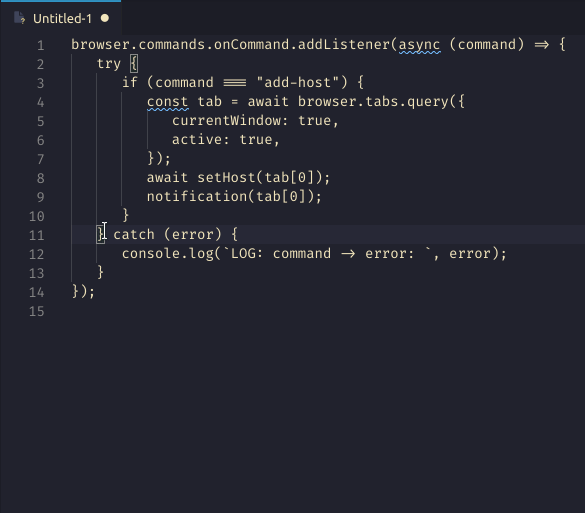

# copyPasta

a small extension to left align copied code snippets for pasting in text fields, for example, discord.

## Usage

1. text needs to be selected. preferably the selection encapsulates all white space.
2. use one of the following methods to activate:
   -  keyboard shortcut:
      -  win/nix: `Ctrl+Shift+C`
      -  mac: `Cmd+Shift+C`
   -  right click -> `copyPasta` context menu
   -  Command Palette(`Ctrl+Shift+P`) -> `copyPasta`

### Credits

> Icons by [Freepik](https://www.flaticon.com/authors/freepik) and [monkik](https://www.flaticon.com/authors/monkik) from [Flaticon](www.flaticon.com) and frankensteined by yours truly 😁
